# GK3HD

This project's goal is to modernize [Gabriel Knight 3](https://en.wikipedia.org/wiki/Gabriel_Knight_3:_Blood_of_the_Sacred,_Blood_of_the_Damned) while faithfully preserving its original look and feel, using its highest supported resolution of 1024×768 as the visual reference.

## Features

### Features and fixes

- 🖥️ Select modern resolutions from the in-game menu
- 🗺️ Restored SIDNEY and driving map functionality at modern resolutions
- ⌨️ Fixed keyboard camera speed to match the 1024×768 reference
- 📐 UI scaled to match the 1024×768 reference
- 💿 Removed the game's disc drive requirement

### Graphics improvements

- ⚙️ Highest-quality graphics settings by default
- 🔍 Added support for and enabled anisotropic filtering by default
- 🖼️ 99.63% of textures (>1024 pixels) upscaled at 4× resolution with [SeedVR2 3B](https://github.com/numz/ComfyUI-SeedVR2_VideoUpscaler)
- 🔤 90% of font atlases reconstructed at 4× resolution for sharper text
- 📍 Corrected location alignment with background on the driving map
- 👁️ Corrected facial feature alignment for 4× textures
- 🎨 Corrected gamma and colors to match the original game's native rendering

### Performance and compatibility improvements

- ⚡ Modern Vulkan rendering with an improved [D7VK](https://github.com/WinterSnowfall/d7vk) build
- 🚀 Faster high-resolution rendering with fewer readbacks and less overhead
- 🧩 Support for the Steam and GOG editions
- 🐧 Experimental Linux and Steam Deck support through Proton

## Install and use

> [!WARNING]
> `gk3hd` is currently considered beta software.

> [!TIP]
> On Linux, install/select Proton in Steam first and close GK3 before
> running the command in Desktop Mode. Settings are written through that game's
> Proton registry, including its `ddraw` override.

[Install uv](https://docs.astral.sh/uv/), then run this from a terminal on
Windows or on Linux with Steam and Proton:

```sh
uvx gk3hd install  # Download & install renderer, patch `GK3.exe`, download & install textures
uvx gk3hd status
uvx gk3hd uninstall
```

Installation selects the current display resolution and finds Steam libraries
automatically. Windows requires Vulkan-capable graphics drivers.
Nonstandard game locations can use `--game-dir PATH` (protected Windows folders
may require an elevated terminal).

## Advanced use

Use `gk3hd --help` for an overview of all top-level commands.

### Patch the game

```sh
uvx gk3hd patch list               # Browse patch groups and individual patches
uvx gk3hd patch install --dry-run  # Preview without changing the game
uvx gk3hd patch install            # Apply the recommended executable patches
uvx gk3hd patch verify             # Verify patches and game settings
uvx gk3hd patch uninstall          # Restore the original executable and settings
```

This leaves the renderer and textures untouched. Game location and display resolution are detected
automatically; override them with `--game-dir PATH` and `--resolution 3840x2160`.
Use `--group GROUP` or repeat `--patch PATCH_ID` to choose patches from `patch list`.
The two groups are `recommended` (default) and `testing` (recommended patches plus
skipping all movies). `--dry-run` lists the exact patches, including dependencies, without
changing the game.

### Build and install the renderer

Install the published renderer independently, or build our modified D7VK locally:

```sh
uvx gk3hd renderer build            # Download source, build and test in `<GAME>/gk3hd/renderer/`
uvx gk3hd renderer install --local  # Reinstall the last verified local build
uvx gk3hd renderer verify           # Check the DLL and its platform settings
uvx gk3hd renderer uninstall        # Restore the previous renderer and settings (uninstall patches first)
```

Close GK3 before installation or removal. No manual copying or registry editing is needed.
Building requires the Windows C++ toolchain, activated automatically from a normal terminal;
install the result with `renderer install --local`.
Builds live under `<GAME>/gk3hd/renderer/`; matching verified builds are reused.
The game is detected automatically; use `--game-dir PATH` to select another installation.
`install --local` finds that game's last verified build, regardless of your current directory.
See the [native build requirements](src/gk3hd/renderer/README.md#build).
Use `renderer download` to download only, or
`renderer install --dll PATH` to select a local DLL. `renderer uninstall` restores
the previous settings after executable patches have been removed.

### Extract, upscale, and install textures

To extract and upscale the original textures locally, use a persistent tool
installation:

```sh
uv tool install "gk3hd[upscale]" --torch-backend auto
gk3hd textures extract          # Extract BMPs from game archives to `<GAME>/gk3hd/textures/original/`
gk3hd textures analyze          # Classify textures and write `<GAME>/gk3hd/textures/texture-analysis.json`
gk3hd textures upscale          # Apply each texture's pipeline and write PNGs to `<GAME>/gk3hd/textures/upscaled/`
gk3hd textures pack             # Bundle PNGs into a versioned texture-pack ZIP (or ZIP parts)
gk3hd textures install --local  # Convert the local pack to BMPs in `<GAME>/gk3hd/textures/installed/` and enable in `GK3.ini`
gk3hd textures verify           # Verify installed textures and their `GK3.ini` configuration
gk3hd textures uninstall        # Remove installed textures and restore the previous `GK3.ini`
```

These commands discover GK3 automatically and keep every texture stage under
`gk3hd/textures/` in the game directory: extracted BMPs in `original/`, the
shared `texture-analysis.json` beside the stage directories, release-ready PNGs
in `upscaled/`, and game-ready BMPs in `installed/`.

uv's automatic PyTorch backend selection uses a supported GPU when one is
available and otherwise falls back to CPU. CPU upscaling works, but is much
slower. Project checkouts select PyTorch's CUDA build on Windows automatically.

## Development

### Test

From a checkout:

```sh
uv run poe lint                   # Formatting, lint, types and spelling
uv run poe test                   # Fast tests; never launches GK3
uv run poe test --slow            # Also test reconstruction and native patch execution
uv run poe coverage              # Both suites with coverage (slower instrumentation)
uv run poe visual                 # 12 views: ten day-one scenes, SIDNEY and the driving map
uv run poe visual --suite medium  # 25 views across all three days, including key interfaces
uv run poe visual --suite large   # 100 views: varied locations, characters and interface states
uv run poe visual -k driving      # Select the driving interaction checks
```

CI runs both portable suites on Linux. Windows API tests run automatically on
Windows and are excluded elsewhere. Neither suite needs the game or downloads
AI models; slow tests use small, representative fixtures, not the full texture catalog.
To run only slow tests, use `uv run poe test --slow -m slow`.

Visual tests require a patched game with its renderer and textures installed.
They compare original textures at 1024×768 against the mod at 4K, using one
generated save and curated camera recipes; your own saves are left untouched.
The sets are nested: medium includes small, and large includes medium. Medium
also covers inventory, the driving map, SIDNEY, save/restore, the title and a
timeblock. Large adds more interface states and locations.
Captures and animated WebPs go to ignored `build/visual/`, not your game folder.
Resume an interrupted run with `--resume build/visual/<run>`; unchanged, verified
world captures are reused. Start a new run after changing the game, assets or camera recipes.
Passing capture checks does not replace reviewing the images for visual fidelity.
Use `uv run --extra upscale gk3hd textures review` to compare texture pipeline alternatives.

### Release

Commit your changes on `main` using conventional commits. From a clean checkout,
choose which assets to include:

```sh
uv run gk3hd package draft                       # New package; reuse published assets
uv run gk3hd package draft --textures            # Also pack/upload the local upscaled PNGs
uv run gk3hd package draft --renderer            # Also upload the last verified local renderer build
uv run gk3hd package draft --textures --renderer # Include both
```

Generate/review changed textures with `textures analyze` and `textures upscale`,
or build a changed renderer with `renderer build`, before drafting the release.

The draft command uses Commitizen to bump the version, runs normal checks,
commits release metadata, pushes the tag, and uploads a GitHub draft. Don't run
`cz bump` or `textures pack` separately. Review and publish the draft on GitHub
to publish to PyPI. Keep older asset releases available for pinned texture packs.
`package verify` checks that the published assets match their recorded identities.

## Gallery

> [!NOTE]
> This gallery showcases ten Day 1 scenes plus SIDNEY and the driving map, alternating between the original at 1024×768 and GK3HD at 4K.
> Open an image to inspect it at full resolution.

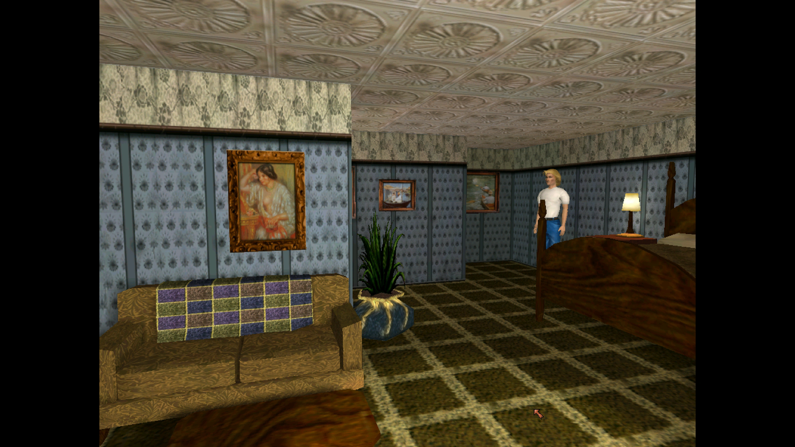

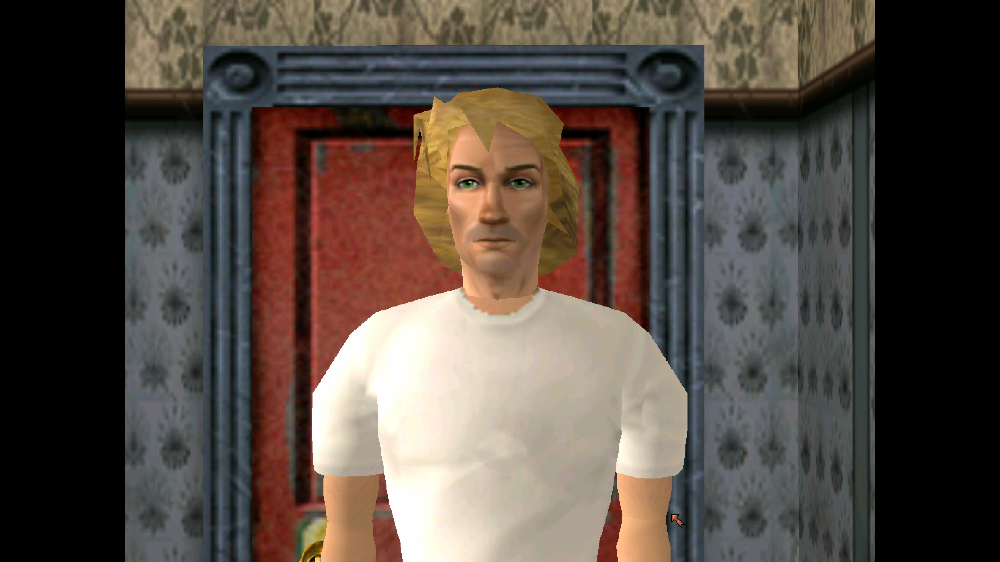

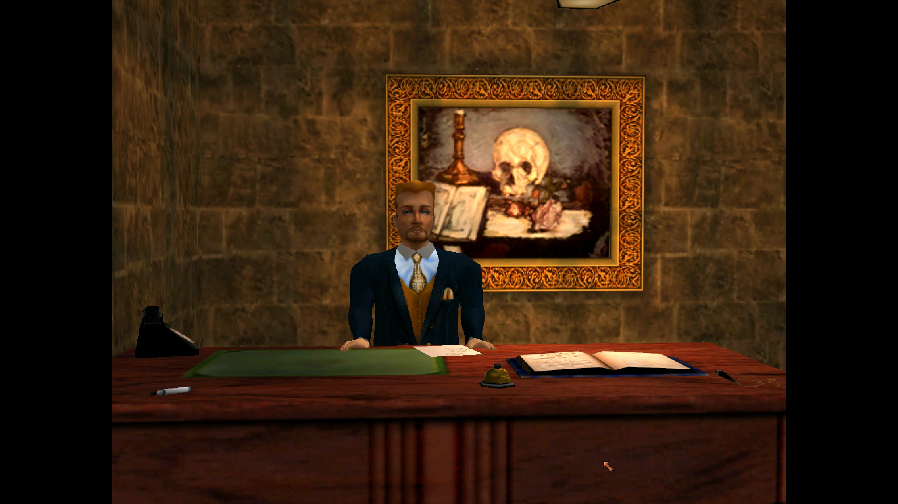

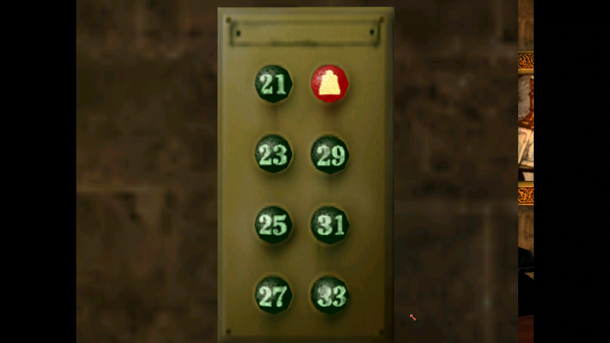

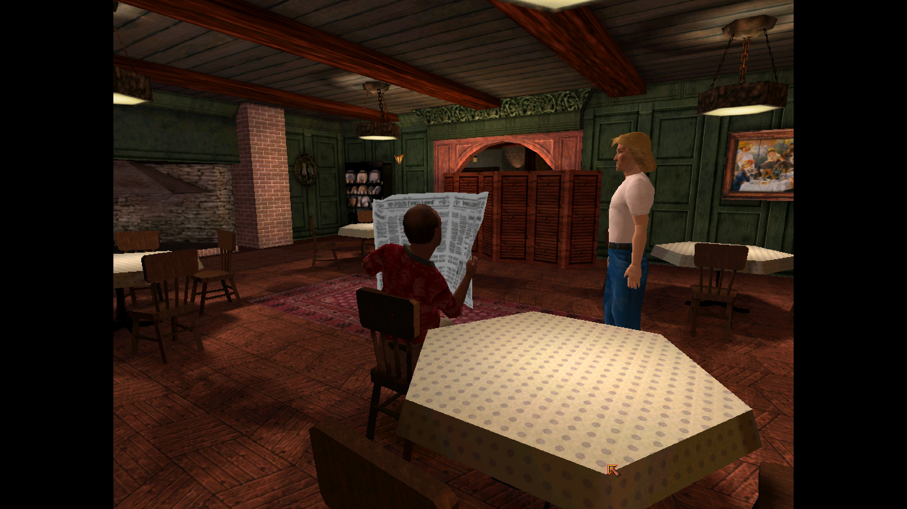

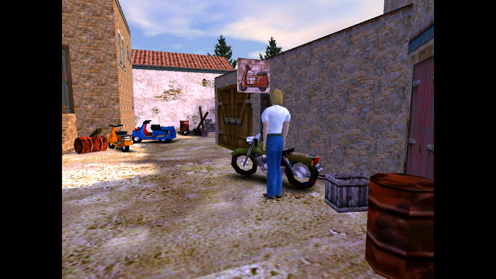

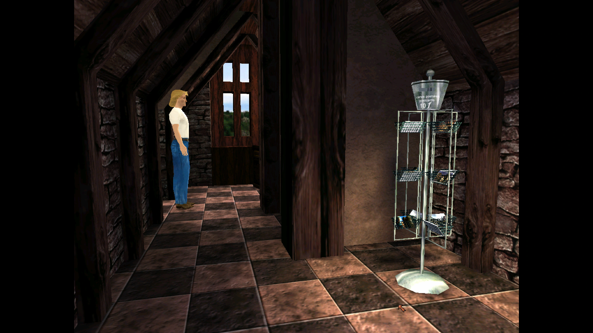

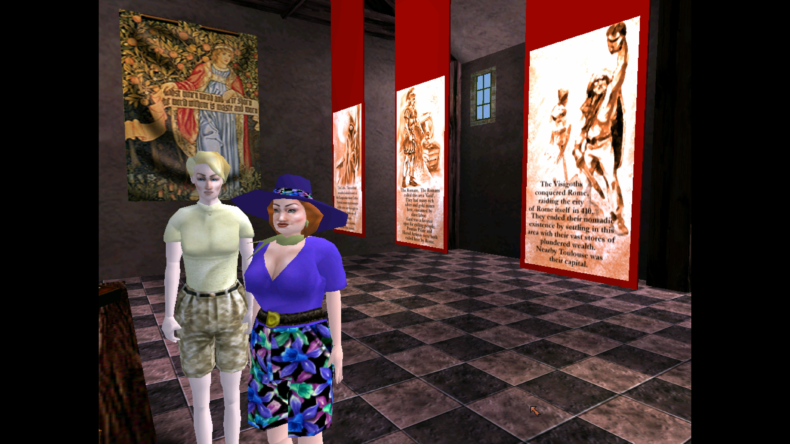

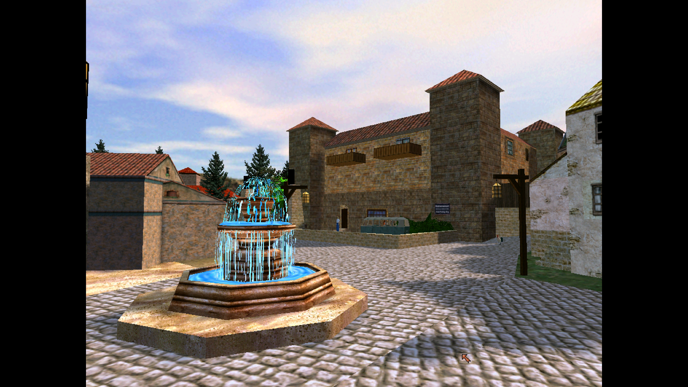

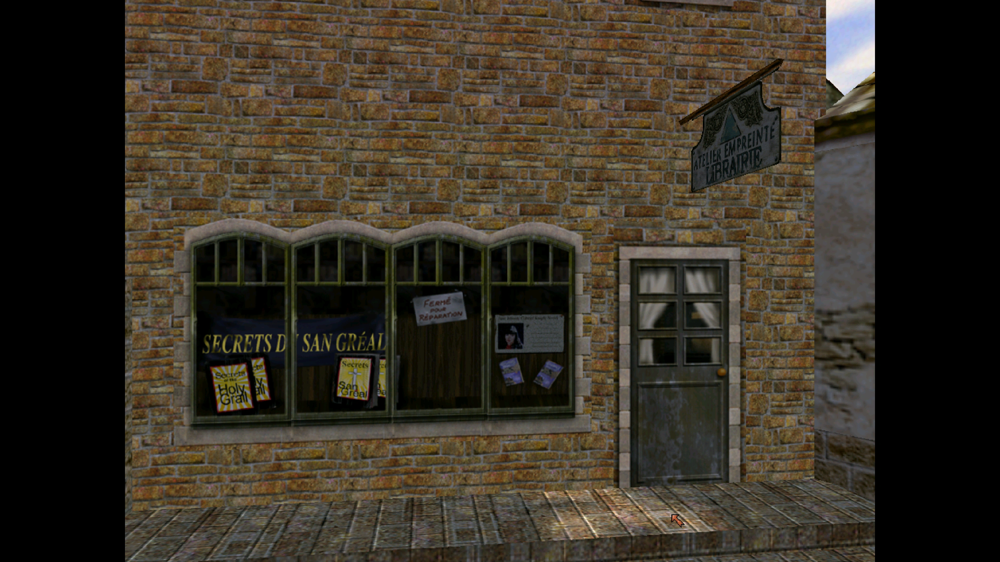

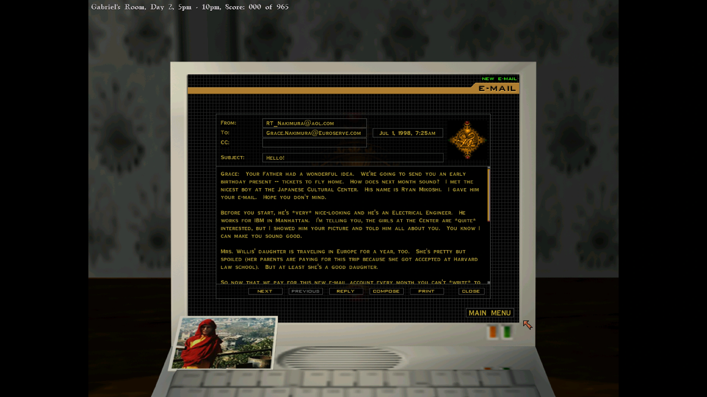

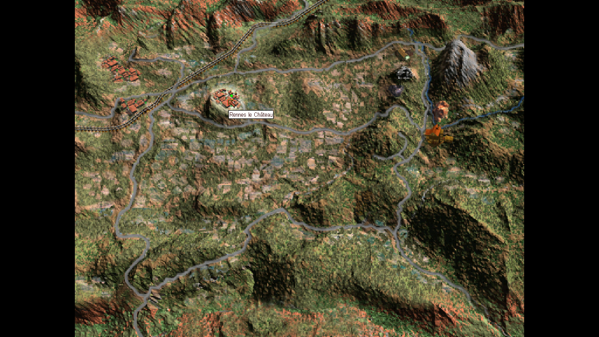
